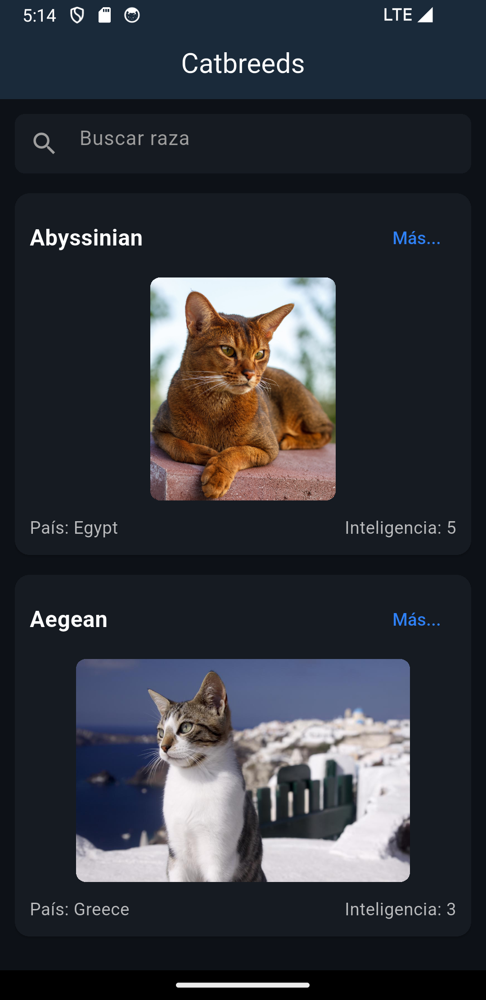
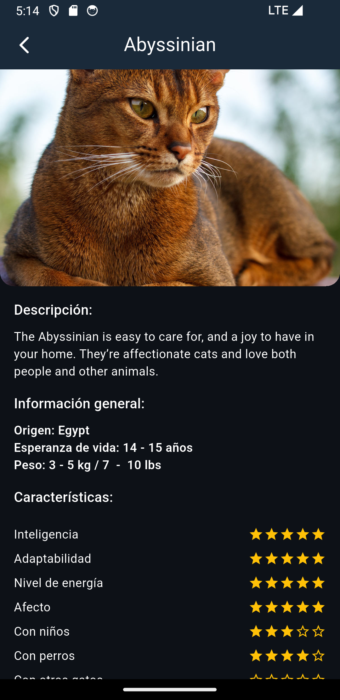
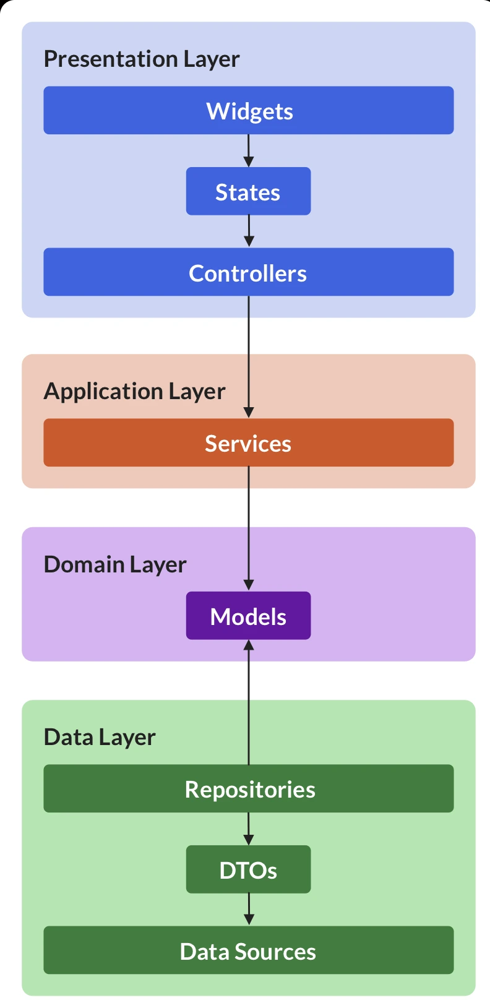

# 🐱 Cat Breeds App

Una aplicación Flutter que muestra una lista de razas de gatos con búsqueda, paginación y vistas detalladas. Está estructurada siguiendo una arquitectura por capas inspirada en el enfoque **Riverpod Architecture**.

---

## 📸 Capturas de pantalla

| Pantalla Principal | Detalle de Raza |
|--------------------|-----------------|
|  |  |

---

## 🧱 Arquitectura basada en Riverpod

Esta app sigue una arquitectura por capas clara (data, domain, application, presentation), basada en el enfoque **Riverpod Architecture** propuesto por **Andrea Bizzotto (Code With Andrea)**.



### Capas de la arquitectura:

- **Presentation Layer**  
  Contiene los `Widgets`, estados (`StateNotifier`, `StateProvider`) y controladores que manejan la interfaz y sus eventos.

- **Application Layer**  
  Aquí se ubica la lógica de aplicación (como `providers.dart`) que conecta la presentación con la lógica del dominio.

- **Domain Layer**  
  Incluye modelos puros (sin dependencias externas) y representa las entidades del dominio.

- **Data Layer**  
  Implementa los `repositories`, `DTOs`, y fuentes de datos externas (como APIs).

---

## 📂 Estructura del proyecto

```bash
lib/
├── api/
│   ├── api_keys.dart
│   └── api.dart
├── core/
│   └── config/
│       └── dio_config.dart
├── features/
│   └── cat_breed/
│       ├── application/
│       │   └── providers.dart
│       ├── data/
│       │   └── repositories/
│       │       └── cat_breed_repository.dart
│       ├── domain/
│       │   └── models/
│       │       ├── breed.dart
│       │       ├── breed_image.dart
│       │       └── cat_breed.dart
│       └── presentation/
│           ├── breed_detail_screen.dart
│           ├── breed_pagination_controller.dart
│           ├── cat_breeds_screen.dart
│           ├── cat_card.dart
│           ├── lista_cat_cards.dart
│           └── mas_button.dart
├── theme/
├── main.dart
```

# ⚙️ Tecnologías usadas

- **Flutter** 3.22.0 (usando **FVM** 3.32.8)
- **Riverpod** (`flutter_riverpod`) para gestión de estado
- **Dio** para llamadas HTTP
- **Arquitectura modular por capas** (Presentation, Application, Domain, Data)
- **Paginación con scroll**
- **Búsqueda con debounce**
- **UI adaptada a Android/iOS**

---

# 🚀 Cómo ejecutar

### 1. Clona el repositorio

```bash
git clone https://github.com/MaxAgui/prag_cat_breed.git
cd prag_cat_breed
```

### 2. Instala las dependencias con FVM

```bash
fvm install
fvm flutter pub get
```

### 3. Corre la app

```bash
fvm flutter run
```

---

## ✅ Funcionalidades destacadas

- 🔍 Búsqueda con debounce
- 📄 Detalles completos de cada raza
- 📥 Paginación por scroll con límite
- 🎨 Comportamiento visual diferenciado Android/iOS
- 🧠 Separación por capas basada en buenas prácticas

---

## 🙋 Autor

Desarrollado por **Manuel Aguilar**  
🔗 [LinkedIn](https://www.linkedin.com/in/manumaxaguilar/)

---
